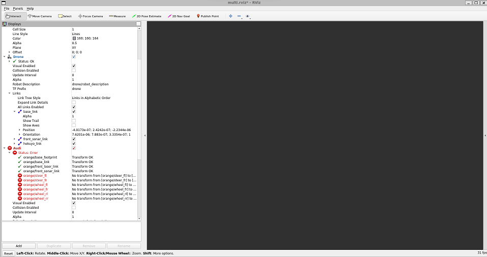

FAQ
=========================

## [audi_husky.launch.py] is neither a launch file in package [gazebo_tf] nor is [gazebo_tf] a launch file name

The error indicates ROS is unable to find the package that contains this file, which is tied to the simulation.

There are three possible reasons for this.

1) Your symbolic link is not correct

```bash
cd ~/ros2_ws/src
ls -la 
```
You should see <span style="color:teal">pfms_ros</span> in teal. If it is in red then your symbolic links is not correct. Not to despair we can simply re-link it, deleting a symbolic link is like removing a shortcut. You do need to find the location of your pfms_ros file which is in the pfms_support repository. For me this is ~/git/pfms_support/pfms_ros. If you accidentally checked out pfms_support elsewhere you can move it (using `mv` command), look up the syntax on the internet.

```bash
cd ~/ros2_ws/src
rm pfms_ros
ln -s ~/git/pfms_support/pfms_ros 
```
2) You have not compiled the packages

You need to execute `colcon build --symlink-install` within the `ros2_ws` folder as per instructions. When colcon is running it will take some time to compile a lot of libraries and executable(s) and will give you update on progress `[ XX%]` where XX is a number from 0-100. 

If `colcon` only produces few lines an error check if you have actually customised Linux for PfMS, in particular section on [install ROS and all other required packages](https://canvas.uts.edu.au/courses/26214/pages/customising-linux-install-for-pfms?wrap=1) and read next section below about ~/.bashrc

If `colcon` causes your computer to freeze, it might be becasuse by default it tries to use 4 cores to compile, you can try `colcon build --sumlink-install -j1` which only uses one core.

3. You have not sourced your workspace

Check your ~/.bashrc file to see if your workspace had been configured correctly

```bash
tail ~/.bashrc
```

The last few should look something exactly like this (you should have only two lines  `sources )

```bash
source /opt/ros/humble/setup.bash
source /home/student/ros2_ws/install/setup.bash
```

If they are not use nano editor. Open the file via`nano ~/.bashrc`  then remove the lines so the only thing you have is the `source /opt/ros2/humble/setup.bash ` part. Edit the file using arrows/backspace (the screen does not respond to a mouse), you can navigate via arrow keys to the bottom of file and use CTRL+K to remove whole lines at once, or use backspace to delete a character at a time. Save the file via CTRL+X and Y (follow prompts).

Now rebuild the package, best done by also deleting previous `build` and `devel` folders.

```bash
cd ~/ros2_ws
rm -rf build install log
colcon build --symlink-install
```

Then execute `echo "source ${HOME}/ros2_ws/install/setup.bash" >> ~/.bashrc`

Just sanity check again

```bash
tail ~/.bashrc
```

If it all looks good then execute `source ~/.bashrc`. This should not report errors (about unknown locations). 

## RVIZ only shows gray screen instead of robot

If your RVIZ is not showing anything, it is blank as per image below. The fix is to add the command into your `~/.bashrc`. If your using WSL we have already specified adding this (remember the issue with xeyes and the linux kernel included on WSL).

```bash
export LIBGL_ALWAYS_SOFTWARE=true
```



Use nano editor, open file via`nano ~/.bashrc`  . Edit the file using arrows/backspace (the screen does not respond to a mouse), you can navigate via arrow keys to the bottom of file and then add the command. Save via CTRL+X and Y (follow prompts).


## Error while loading shared libraryies: libpipes.so: cannot open shared object file

This error occurs when trying to execute (run) `./command_ugv` and is not related to the building process, pipes indeed exists on your system, it is related to the runtime environment (when you try to run the executable).

Try executing `ldconfig` in the terminal window prior to running `./command_ugv`. 
