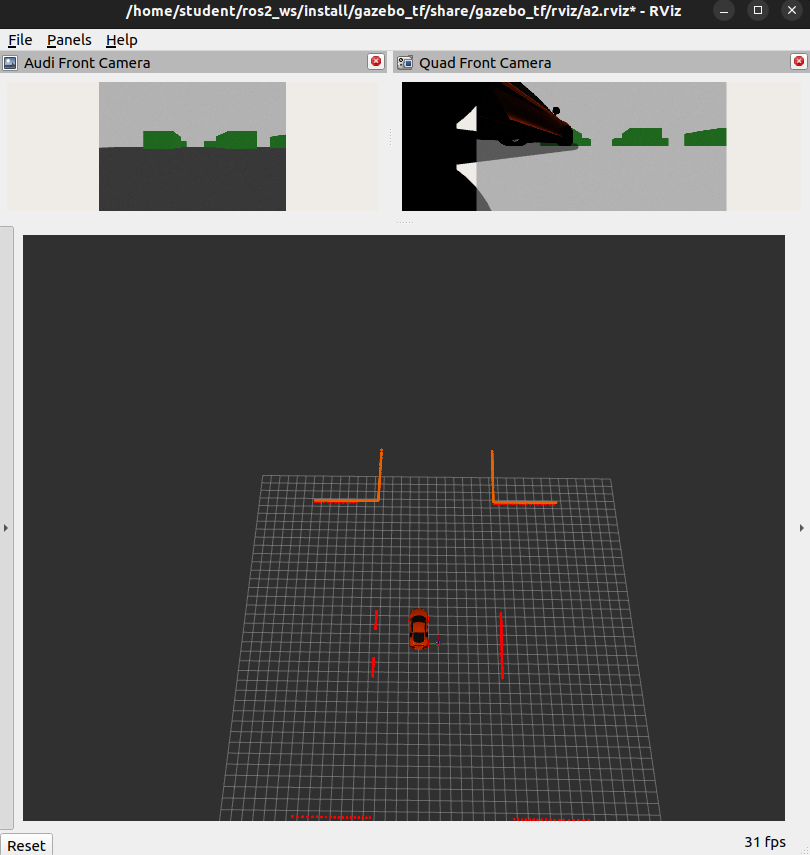

PFMS Support - Setup
=========================

This github repository no longer hosts packages that can be used for PFMS subject. 

To obtain packages for the subject you will need to have ROS2 Humble installed and follow the steps below.

Add the PFMS GPG key with apt.

```
curl -fsSL https://41012.github.io/ppa/ubuntu/KEY.gpg | sudo gpg --dearmor -o /usr/share/keyrings/pfms-archive-keyring.gpg
```

Add the repository to your sources list, together with above step this allows your system it will accept packages for PFMS.

```
echo "deb [signed-by=/usr/share/keyrings/pfms-archive-keyring.gpg] https://41012.github.io/ppa/ubuntu ./" | sudo tee /etc/apt/sources.list.d/pfms.list
```

We now update the apt repository caches, packages. It is always recommended that you ensure your system is up to date before installing new packages.

```
sudo apt update
```

Now we install packages for pfms and any missing ros-dev tools.

```
sudo apt install pfms-ros-integration ros-humble-pfms ros-dev-tools
```

## Running Simulator

You will need to launch the appropriate launch file if your running any code that sends commands or receives data from the simulator. The terminal where you have executed the `ros2 launch` command is active, keep it running while you use the simulator (your testing your code). To terminate the simulator you have to execute CTRL+C in the terminal window.

**Assignment 1** (audi and husky) `ros2 launch pfms a1.launch.py`


**Assignment 2** (audi and drone) `ros2 launch pfms a2.launch.py`  



Version Check
-------------------------

To check versions of your installed files 

```
dpkg -l | grep pfms
```

### Current versions

| package              | version      |
| -------------------- | ------------ |
| pfms-ros-integration | 3.0.7        |
| ros-humble-pfms      | 0.3.0-0jammy |

## Upgrades

Any packages are updated as part of apt

```bash
sudo apt update
sudo apt install --only-upgrade pfms-ros-integration ros-humble-pfms
```

Any code that links to pfms libraries (such as tutorials or your own assignment code) needs to be rebuilt. Otherwise you will receive error which contains 
```
sysmalloc: Assertion `(old_top == initial_top (av) && old_size == 0) 
```
Therefore from build directory of any of your code you can force it to rebuild by executing:

```bash
rm CMakeCache.txt
cmake ..
make clean
make
```

