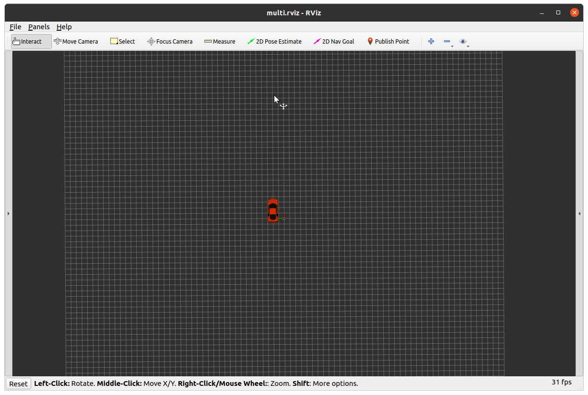

Assignment 1 - Setup
=========================

**PREREQUISITE:** you have installed ROS and created a catkin workspace as per instructions on canvas in week 00. 

**UPDATED: 09 MARCH 19:41**

[TOC]

## Installation

If not done already:

```bash
cd ~/git
git clone git@github.com:41012/pfms-support.git
```

Proceed to install the pipes library, which has been supplied to allow using the physics simulator, at present bypassing the ROS framework for students.

Please select the pipes package for the version of ROS you have (there is an additional package for arm64 processors as well)

```bash
cd pfms-support
cd packages
sudo dpkg -i pipes-2.3.0-noetic-Linux.deb
```

Then link the `a1_ros` folder to your `catkin_ws/src`

```bash
cd ~/catkin_ws/src
ln -s ~/git/pfms-support/pfms-ros 
```
Now we can make the package.

```bash
cd ~/catkin_ws
catkin_make
```

You should now have all the required software. 

## Running Simulator

You can launch the simulator for the audi , drone or both. You will need to launch the simulator if your running any code that sends commands or receives data from the simulator. 

```
roslaunch gazebo_tf multi.launch
```


The terminal where you have executed this command is active, keep it running while you use the simulator (your testing your code). To terminate the simulator you have to execute CTRL+C in the terminal window.

Instead of `multi.lauch` you can run `ugv.launch` for the car or `uav.launch` for the drone.

You can run other commands in another terminal.  For instance there is also a gui for the quadcopter that you need to run from another terminal (just for sanity checking), hit `Z` first to enable control.

```bash
rosrun sjtu_drone drone_keyboard
```

Terminate this GUI by clicking the CANCEL button.

Version Check
-------------------------

To check versions of your installed files if there is an update provided

```
rosversion audibot_gazebo
rosversion gazebo_tf
rosversion sjtu_drone
dpkg -l | grep pipes
```

### Current versions

| package        | version  X.Y.Z |
| -------------- | -------------- |
| audibot_gazebo | 0.2.1          |
| gazebo_tf      | 0.1.2          |
| sjtu_drone     | 0.0.0          |
| pipes          | 2.3.0          |

### Upgrades

To update any of the libraries make sure `git pul` from `~/git/pfms-support`

To update **pipes** library execute below (where you need to specify the correct package name, where you need to match the X.Y.Z at current version in table,  your `ROSVERSION` (`melodic` and `noetic`) and your system (`Linux` or `arm64`).

```bash
cd ~/git/pfms-support/packages
sudo dpkg -i pipes-X.Y.Z-ROSVESRION-SYSTEM.deb
```
To update **all other packages** recompile your catkin workspace

```bash
cd ~/catkin_ws
catkin_make
```

