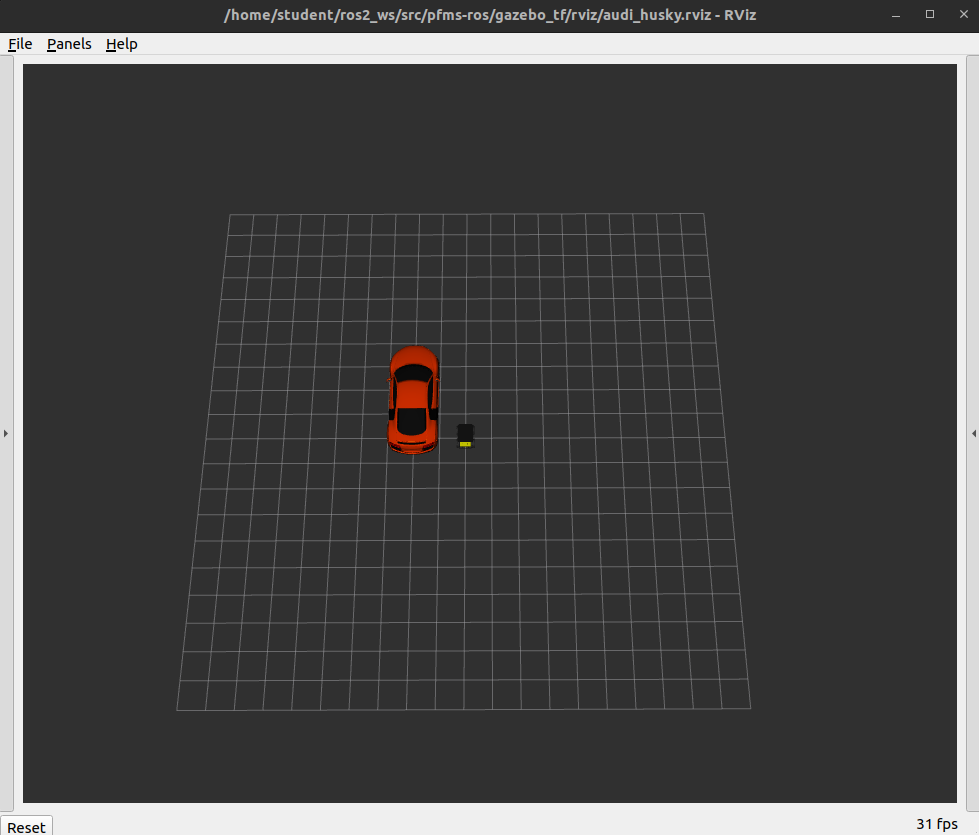

PFMS Support - Setup
=========================

**PREREQUISITE:** 

- On Azure ROS2 and an workspace have been setup. 
- On your own device install ROS2 and created a workspace as per instructions on [canvas](https://canvas.uts.edu.au/courses/30581/pages/customising-linux-install-for-pfms?wrap=1).

Installation:

- On Azure we have installed pfms support packages. 
- For your own devices refer [INSTALLATION](INSTALLATION.md)

Always check if you need to update pipes (information below on how to check version and undertake an update). This does not occur frequently, a Teams Announcement is made to indicate a new version is released. If you get stuck in install or behaviour or running is odd there is a [Frequently Asked Questions - FAQ](./FAQ.md)

## Running Simulator

You can launch the simulator for the audi and husky. You will need to launch the simulator if your running any code that sends commands or receives data from the simulator. 

```
ros2 launch gazebo_tf audi_husky.launch.py
```
The terminal where you have executed this command is active, keep it running while you use the simulator (your testing your code). To terminate the simulator you have to execute CTRL+C in the terminal window.



Version Check
-------------------------

To check versions of your installed files if there is an update provided

```
dpkg -l | grep pipes
```

### Current versions

| package | version  |
| ------- | ---------|
| pipes   | 3.0.2    |

## Upgrades

There are 3 steps:

1) update **pipes** library

Execute below (make sure you use the library for your system (`amd64`), there is an `arm64` version for Mac and RPi devices). 

```bash
cd ~/git/pfms-support
git pull
sudo apt install ./packages/pipes_3.0.2-humble_amd64.deb
sudo ldconfig
```

Just ignore apt related `W: ... _apt ...` warning lines. They're non-fatal, and for the most part you can't fix this, and you'll get the same results with or without the warning.

2) update **ros2_ws packages**

Recompile your ros2 work-space, which will bring other changes needed,

```bash
cd ~/ros2_ws
colcon build --symlink-install
```

3) re-link your code to the updates.

Any code that links to pipes (such as command_ugv) or your own assignment code needs to be rebuilt. From build directory of your code you can execute:

```
rm CMakeCache.txt
cmake ..
make clean
make
```

