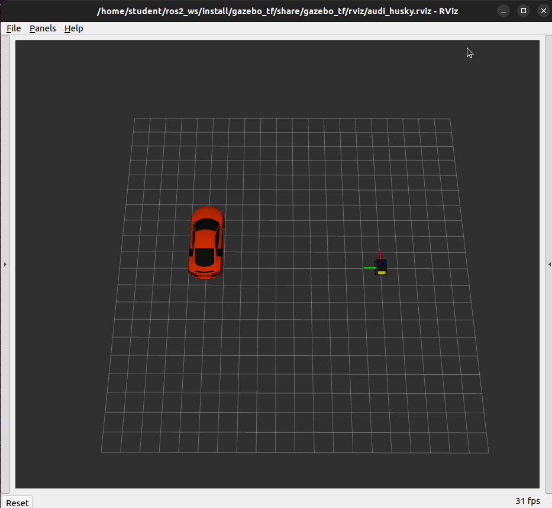

PFMS Support - Setup
=========================

**PREREQUISITE:** you have installed ROS and created a catkin workspace as per instructions on canvas in week 00 (Azure has all installed, refer to Update)

If you get stuck in install there is a [Frequently Asked Questions - FAQ](./FAQ.md)

## Installation

If not done already:

```bash
cd ~/git
git clone git@github.com:41012/pfms-support.git
```

Proceed to install the pipes library, which has been supplied to allow using the physics simulator, at present bypassing the ROS framework for students.

```bash
cd pfms-support
cd packages
sudo dpkg -i pipes_3.0.0-humble-amd64.deb
sudo ldconfig
```

If not done already, link the `pfms_ros` folder to your `ros_ws/src`

```bash
cd ~/ros_ws/src
ln -s ~/git/pfms-support/pfms-ros 
```
Now we can make the package.

```bash
cd ~/ros_ws
colcon build --symlink-install
```

You should now have all the required software. 

## Running Simulator

You can launch the simulator for the audi and husky. You will need to launch the simulator if your running any code that sends commands or receives data from the simulator. 

```
ros2 launch gazebo_tf audi_husky.launch.py
```


The terminal where you have executed this command is active, keep it running while you use the simulator (your testing your code). To terminate the simulator you have to execute CTRL+C in the terminal window.

Version Check
-------------------------

To check versions of your installed files if there is an update provided

```
dpkg -l | grep pipes
```

### Current versions

| package | version  X.Y.Z |
| ------- | -------------- |
| pipes   | 3.0.0          |

## Upgrades

To update any of the libraries make sure `git pull` from `~/git/pfms-support`

To update **pipes** library execute below (where you need to specify the correct package name, where you need to match the X.Y.Z at current version in table,  your `ROSVERSION` (`humble`) and your system ( `amd64`). 

```bash
cd ~/git/pfms-support/packages
sudo dpkg -i pipes-X.Y.Z-ROSVERSION-SYSTEM.deb
```

If your working on any code that links to pipes (such as command_ugv) or your own assignment code. It is always good practice to rebuild it. So from build directory.

```
rm CMakeCache.txt
cmake ..
make
```

To update **all other packages** recompile your catkin workspace

```bash
cd ~/ros_ws
colcon build --symlink-install
```
